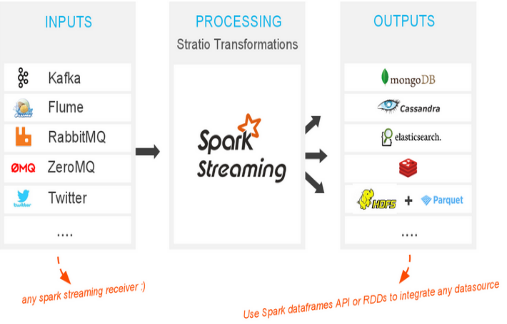

Architecture Guide
******************

Sparkta overview
===========
Explain the workflow

.. figure:: images/sparkta1.png
   :alt: Spark Architecture Overview

Key Components
=============

- `Spark Streaming & Spark <http://spark.apache.org>`__
- `SparkSQL <https://spark.apache.org/sql>`__
- `Akka <http://akka.io>`__
- `MongoDB <http://www.mongodb.org/>`__
- `Apache Cassandra <http://cassandra.apache.org>`__
- `ElasticSearch <https://www.elastic.co>`__
- `Redis <http://redis.io>`__
- `Apache Parquet <http://parquet.apache.org/>`__
- `HDFS <http://hadoop.apache.org/docs/r1.2.1/hdfs_design.html>`__
- `Apache Kafka <http://kafka.apache.org>`__
- `Apache Flume <https://flume.apache.org/>`__
- `RabbitMQ <https://www.rabbitmq.com/>`__
- `Spray <http://spray.io/>`__
- `KiteSDK (morphlines) <http://kitesdk.org/docs/current>`__

Inputs
=============

- `Twitter <inputs.html#twitter-label>`__
- `Kafka <inputs.html#kafka-label>`__
- `Flume <inputs.html#flume-label>`__
- `RabbitMQ <inputs.html#rabbitMQ-label>`__
- `Socket <inputs.html#socket-label>`__

Outputs
=============

- `MongoDB <outputs.html#mongodb-label>`__
- `Cassandra <outputs.html#cassandra-label>`__
- `ElasticSearch <outputs.html#elasticsearch-label>`__
- `Redis <outputs.html#redis-label>`__
- `Print <outputs.html#print-label>`__
- `Parquet <outputs.html#parquet-label>`__
